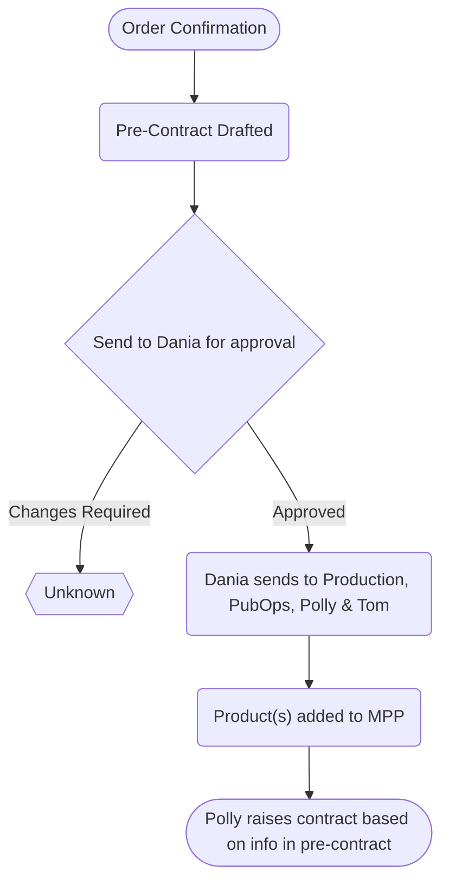

1. Order Confirmation
2. Draft pre-contract
3. Send to Dania for approval
4. Dania sends to Production, PubOps and Polly & Tom
5. Added to MPP
6. Polly raises contract based on info in pre-contracts
