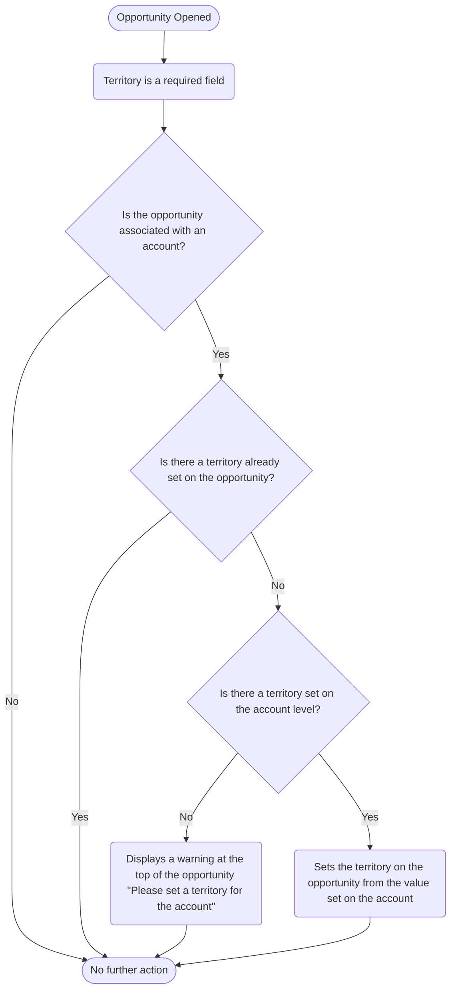

```mermaid
flowchart TD
	oppLoad(["`Opportunity Opened`"])
	terrRequired("`Territory is a required field`")
	checkAcc{"`Is the opportunity associated with an account?`"}
	checkOpp{"`Is there a territory already set on the opportunity?`"}
	checkAccTerr{"`Is there a territory set on the account level?`"}
	displayWarn("`Displays a warning at the top of the opportunity &quot;Please set a territory for the account&quot;`")
	autoFillTerr("`Sets the territory on the opportunity from the value set on the account`")
	fin([No further action])

	oppLoad --> terrRequired --> checkAcc
	checkAcc -->|Yes|checkOpp 
	checkAcc -->|No|fin
	checkOpp -->|No|checkAccTerr
	checkOpp -->|Yes|fin
	checkAccTerr -->|Yes|autoFillTerr
	checkAccTerr -->|No|displayWarn
	displayWarn --> fin
	autoFillTerr --> fin
```
